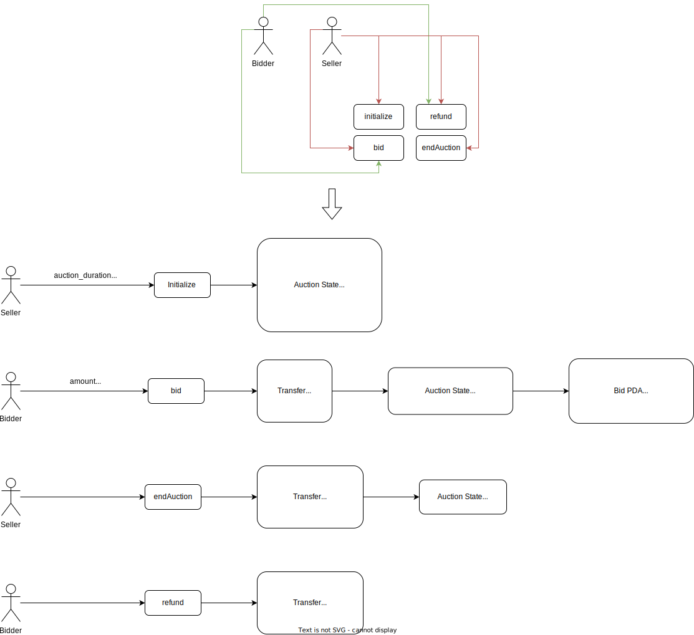

# Simple Open Auction

The general idea of the following auction program is that everyone can 
send their bids during a bidding period. The bids already include sending 
money/sols in order to bind the bidders to their bid. If the highest bid is raised, 
previously the highest bidder can claim her/his money back at the end of an auction. 
After the end of the bidding period, the program has to be called manually for 
the beneficiary to receive their money.

## How To

### Build

```shell
anchor build
```

### Test

- Don't forget to change the program ID in `Anchor.toml` and `programs/auction/src/lib`
  - The program ID should be the result of the `anchor keys list` command
- Change path to your wallet in `Anchor.toml` and airdrop some sols with `solana airdrop <amount>`
(you have to start the `solana-test-validator` before airdrop)
- Make sure your `solana-test-validator` is terminated
- In the `.anchor/program-logs` you can find the logs

```shell
anchor test
```

## Schema

- Without conditions and validations

<p align="center">
   
</p>
